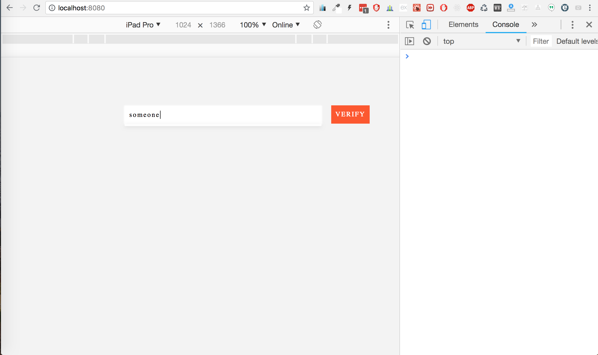
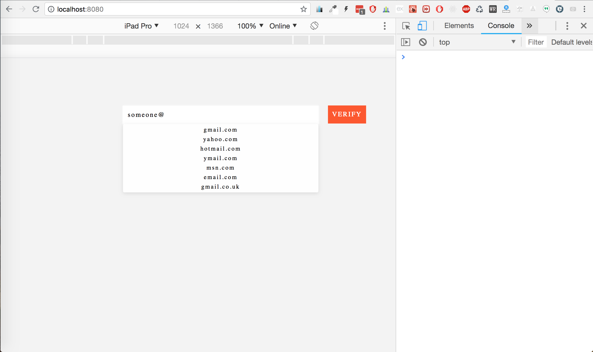
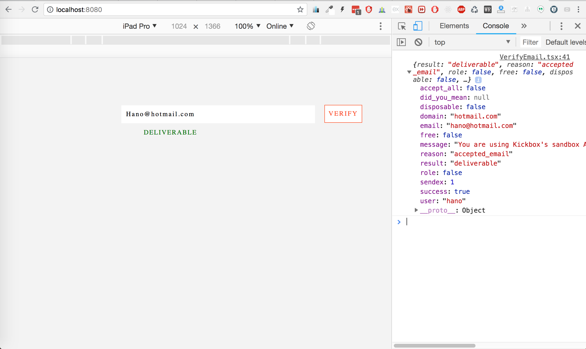
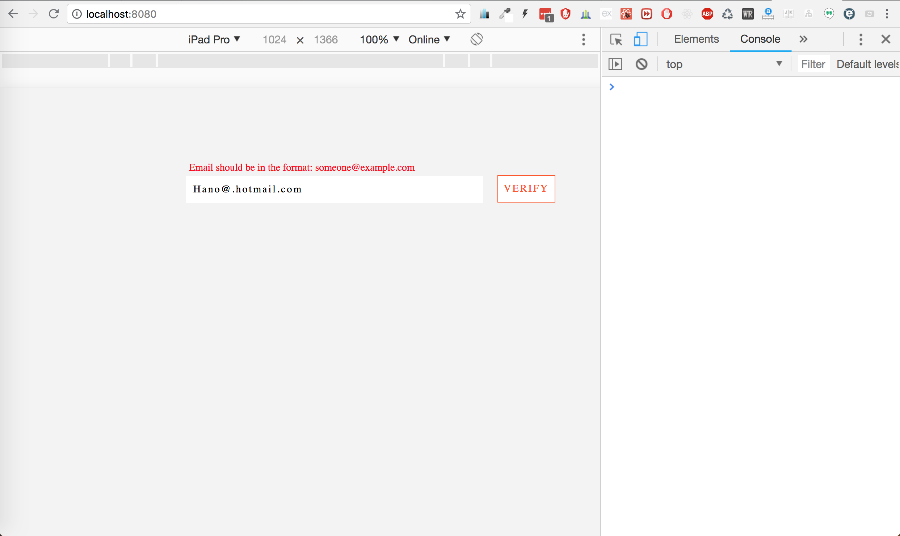

# Email Validator

It verifies weather an email is:
  - Valid?
  - Deliverable?
  - Autocomplete common email extentions
  - and some other features, you can see from the pictures below

#### I've used the following technologies:
  1. react 16.3.6
  2. typescript 2.8.1
  3. Kickboxing API to verify emails
  4. Regular expressions for client side validations
  5. Webpack 4.5.0
  6. and a bunch of loaders where you can visit package.json file and see them
### Installation

You will need to have node installed on your machine, [Node.js](https://nodejs.org/) to run.

Install the dependencies and devDependencies and start the server.

```sh
$ npm install
$ npm start
```

Visit [localhost:8080](http://localhost:8080) from your browser and you would see:

###### Landing page


###### After writing ``@`` sign the common extentoins will popUp


###### What we get back if we try to verify a deliverable email


###### Client Validation in case the users try a wrong email format



`Important Note: You would need to use your own email and sign up with kickboxing API and get and (apiKey) otherwise, users won't be able to verify their email correctly. I have provided the link to get to kickboxing web APIs above. Also you need to paste your apiKey at line 27 in src/Components/VerifyEmail.tsx `
